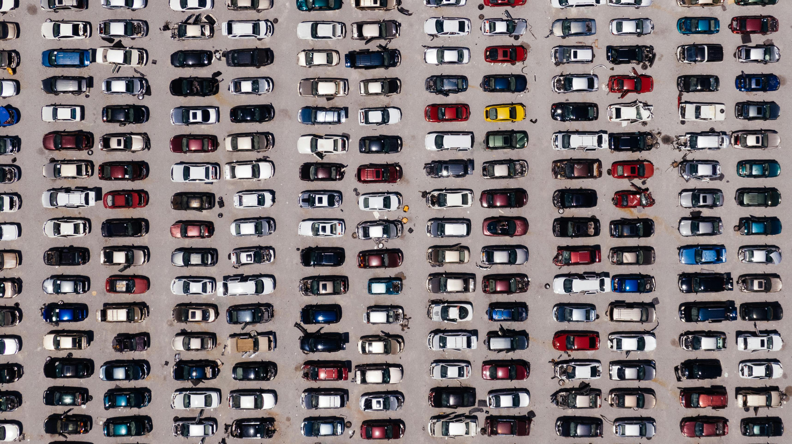

# **__PARKING SPOT PREDICTOR__**

## <ins>Overview</ins>
This repository contains a Time series project focused on predicting parking lot occupancy. The goal is to develop a model that can predict the availability of parking spots in various parking facilities in the city at a given day, helping users plan their parking in advance.

## <ins>Preliminaries</ins>

As this project was a group project, the contributors to this work are as follows:

1. [Mwiti Mwongo](https://github.com/M13Mwongo)
2. [Grace Mutuku](https://github.com/GraceKoki)
3. [Joy Ogutu](https://github.com/Ogutu01)
4. [Ezra Kipchirchir](https://github.com/dev-ezzy)
5. [Mary Gaceri](https://github.com/MaryGaceri)

## </ins>Table of Contents</ins>

- [Business Understanding](#Business-Understanding)
- [Problem Statement](#Problem-Statement)
- [Objectives](#Objectives)
- [Data Understanding](#Data-Understanding)
- [Exploratory Data Analysis (EDA)](#exploratory-data-analysis-eda)
- [Modelling](#Modelling)
- [Deployment (Streamlit)](#deployment-streamlit)
- [Future Steps](#Future-Steps)
- [Technologies Used](#Technologies-Used)

## Business Understanding

Finding a parking place in the busy urban environments of major cities throughout the world is a problem that worries locals, commuters, and tourists equally. The need for effective parking solutions is greater than ever due to the fast urbanization, rising traffic, and expanding population. Our initiative is to change parking management in metropolitan areas confronting comparable difficulties throughout the globe by utilizing data-driven insights in response to this urgent issue. It is impossible to exaggerate the significance of this endeavor for metropolitan areas. Urban centers are the epicenters of activity, drawing millions of people for business, pleasure, and employment because they are social, cultural, and economic magnets. Nonetheless, these cities' disorganized traffic and inadequate parking facilities provide serious difficulties for local government, companies, and citizens. Our initiative intends to improve urban mobility by reducing travel times, relieving traffic congestion, and offering accurate estimates of parking spot availability.

## Problem Statement

The absence of accurate and up-to-date data on parking spot availability not only impedes the development of effective predictive models but also limits the implementation of innovative solutions aimed at addressing urban mobility challenges. Without access to comprehensive data sources, parking prediction systems struggle to provide reliable real-time information, leading to suboptimal parking decisions and increased traffic congestion. Overcoming these challenges is crucial for creating a parking prediction system that not only improves parking navigation but also contributes to the overall sustainability and livability of urban areas by enhancing economic productivity, and fostering a more seamless urban mobility experience for all stakeholders.

## Objectives

### a) Main Objective

To develop a robust time series-based parking spot predictor that accurately forecasts parking spot availability in urban areas, leveraging historical parking data and real-time variables.

### b) Specific Objectives
    
1. To collect and preprocess historical data from various sources and integrate relevant time-varying features, such as time of day, day of the week, holidays, and location into the data.
    
2. To understand the distribution of both numerical columns (capacity, occupancy) and categorical columns (is_holiday) in our data.
    
3. To analyze the monthly and daily average occupancy and average parking availability across all parking facilities, identifying patterns and trends over time.
    
4. To investigate the impact of holidays and time on parking availability, examining how these factors influence parking spot occupancy and demand.
    
5. To explore various time series forecasting techniques, including ARIMA, XGBoost and Prophet and evaluate the performance of each technique using metrics like MAE, MSE and RMSE.
    
6. To develop and deploy a user-friendly interface that allows motorists to access real-time parking predictions and navigate to available parking spots efficiently.

## Data Understanding

The dataset used for this project is available in the data directory. It includes historical information about parking lot occupancy, date, time location, and other relevant features.

Our main data was sourced from the Transport for New South Wales(TfNSW) website, more speficially, from their [Car Park API](https://opendata.transport.nsw.gov.au/dataset/car-park-api).

The holiday data was scrapped from [National Holidays in Australia in 2023](https://www.officeholidays.com/countries/australia/new-south-wales/2023). 

## Exploratory Data Analysis (EDA)

Analysis and visualization of data to understand its characteristics, patterns, and potential insights is done in this section. Histograms, kernel density plots, and box plots are used to understand the distribution of numerical variables and count plot for categorical variables.
On bivariate analysis, relationships between pairs of variables are explored and visualized using bar plots, line plot and correlation heatmap. On multivariate analysis, parking availability patterns across different days of the week and times of the day are visualised using a heatmap

## Modelling

Time series modeling is done using the following three models:- ARIMA to capture linear patterns, Prophet designed for seasonality and holidays, and XGBoost, a versatile ensemble method, to capturing complex non-linear relationships in time series data. Prophet model outperformed the rest of the models and was implemented and the final model.

## Deployment (Streamlit) 

Deployment using Streamlit was done to turn the data-driven Python script into an interactive user interface that allows the end user to select a parking facility and a prospective date. The output given is a predicted number of available parking spots for the given facility at the selected day.
    

## Future Steps

1. To implement a real-time data acquisition pipeline to continuously update the model with the latest parking occupancy data.

2. To conduct pilot tests and gather feedback from end-users to assess the usability and effectiveness of the parking prediction system in real-world scenarios.

3. To deploy the finalized parking spot predictor in urban areas, collaborating with city authorities and parking management companies to integrate it into existing infrastructure and promote widespread adoption.

## Technologies Used
    - Python
    - Jupyter Notebook
    - Machine Learning Libraries (Pandas, sklearn, matplotlib, numpy, scikit-learn, XGBoost, prophet, statsmodels)
